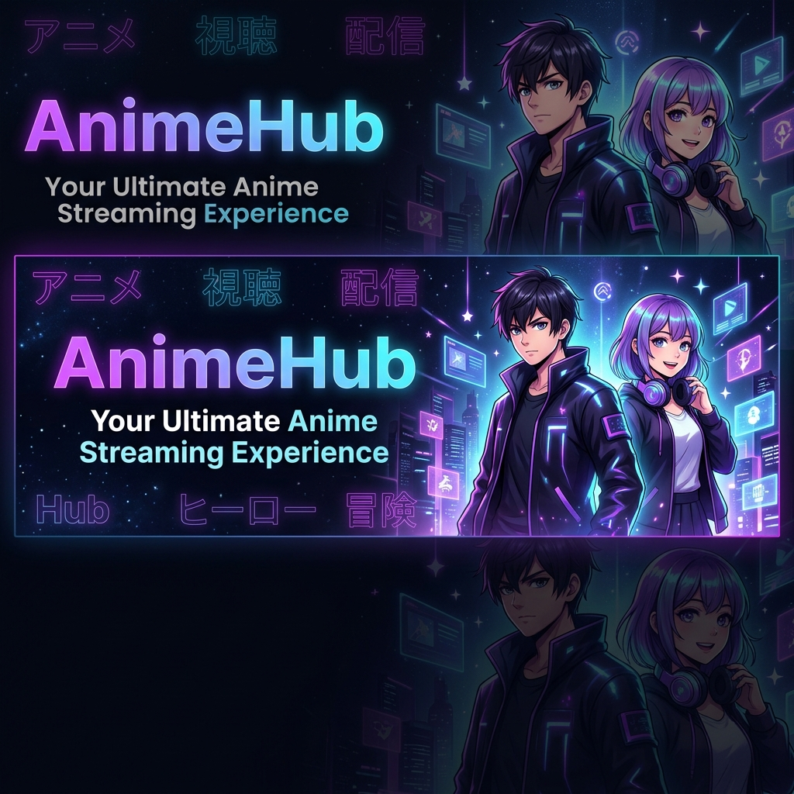

<div align="center">
  
  
  <br/>
  
  
  
  
  
  
  
  <br/><br/>

  <p><strong>AnimeHub Mobile</strong> — A full-featured anime streaming app built with React Native & Expo.<br/>Stream episodes, track your watch history, manage your library, and discover new series.</p>
</div>

---

## ✨ Features

- 🎬 **Stream Anime** — Embedded WebView player with JWPlayer & HTML5 `<video>` support
- ▶️ **Resume Playback** — Automatically resumes from where you left off, per episode
- 📊 **Watch Progress Tracking** — Syncs progress to Supabase every 10 seconds with throttling
- 🔔 **Next Episode Detection** — Auto-shows "Up Next" card in the last 10% of an episode
- 🔍 **Explore & Search** — Browse trending, top-rated, and search across all titles
- 📚 **Library / Watchlist** — Add anime to your personal watchlist
- ❤️ **Favorites** — Mark and track your favourite series
- 👤 **User Profiles** — Avatar, bio, watch stats, badges, streaks & genre breakdown
- 🔒 **Auth** — Email/password authentication via Supabase Auth
- 🌙 **Dark Mode** — Native dark UI throughout
- 📱 **Landscape Player** — Full landscape lock during playback with navigation bar auto-hide
- ⚡ **Optimized Performance** — `useMemo`, `useCallback`, TanStack Query caching, `expo-image` disk caching

---

## 📱 Screens

| Screen | Description |
|--------|-------------|
| **Home** | Trending, top-rated, recent anime rows |
| **Explore** | Search + genre/filter browsing |
| **Library** | Watchlist & personal lists |
| **Profile** | Stats, badges, genre chart, watch history |
| **Watch** | Full-screen WebView player with progress sync |
| **Anime Detail** | Info, episodes list, reviews |
| **Settings** | Account, avatar, password, notifications |
| **Favorites** | Saved favourite anime |
| **History** | Recently watched episodes |
| **Notifications** | In-app notification feed |

---

## 🏗️ Tech Stack

| Layer | Technology |
|-------|-----------|
| **Framework** | [Expo](https://expo.dev) ~52 + [Expo Router](https://expo.github.io/router) v4 |
| **UI** | React Native 0.76, NativeWind v4, Expo Linear Gradient, Expo Blur |
| **State** | [Zustand](https://zustand-demo.pmnd.rs/) + [TanStack Query](https://tanstack.com/query) v5 |
| **Backend** | [Supabase](https://supabase.com) (Postgres, Auth, RLS, Edge Functions) |
| **Player** | `react-native-webview` with injected JS (JWPlayer + HTML5 fallback) |
| **Images** | `expo-image` (automatic disk caching) |
| **Animation** | `react-native-reanimated` v3, `react-native-gesture-handler` |
| **Navigation** | Expo Router (file-based routing) |

---

## 🚀 Getting Started

### Prerequisites

- Node.js ≥ 18
- [Expo CLI](https://docs.expo.dev/get-started/installation/)
- [Supabase account](https://supabase.com)
- Android emulator / physical device (or iOS Simulator on Mac)

### Installation

```bash
# Clone the repository
git clone https://github.com/gamerboy74/Animehub-App.git
cd Animehub-App

# Install dependencies
yarn install

# Apply patches
yarn postinstall
```

### Environment Setup

Create a `.env` file in the project root:

```env
EXPO_PUBLIC_SUPABASE_URL=https://your-project.supabase.co
EXPO_PUBLIC_SUPABASE_ANON_KEY=your-anon-key-here
```

> ⚠️ Never commit `.env` to version control — it is listed in `.gitignore`.

### Supabase Setup

Run the following policies in your **Supabase SQL Editor** to enable progress tracking:

```sql
-- Watch progress policies
CREATE POLICY "Users can insert own progress"
  ON user_progress FOR INSERT WITH CHECK (auth.uid() = user_id);

CREATE POLICY "Users can update own progress"
  ON user_progress FOR UPDATE
  USING (auth.uid() = user_id) WITH CHECK (auth.uid() = user_id);

CREATE POLICY "Users can select own progress"
  ON user_progress FOR SELECT USING (auth.uid() = user_id);

-- Profile policies
CREATE POLICY "Users can update own profile"
  ON users FOR UPDATE
  USING (auth.uid() = id) WITH CHECK (auth.uid() = id);

CREATE POLICY "Users can read own profile"
  ON users FOR SELECT USING (auth.uid() = id);
```

### Running the App

```bash
# Start with Metro bundler (clears cache)
npx expo start --clear

# Or target specific platform
yarn android
yarn ios
```

---

## 📁 Project Structure

```
Animehub-App/
├── app/                        # Expo Router pages (file-based routing)
│   ├── (tabs)/                 # Bottom tab screens
│   │   ├── index.tsx           # Home feed
│   │   ├── explore.tsx         # Search & browse
│   │   ├── library.tsx         # Watchlist & lists
│   │   └── profile.tsx         # User profile & stats
│   ├── anime/[id].tsx          # Anime detail page
│   ├── watch/[id].tsx          # Video player screen
│   ├── settings.tsx            # Account settings
│   ├── favorites.tsx           # Favourites list
│   ├── history.tsx             # Watch history
│   └── notifications.tsx       # Notification feed
├── src/
│   ├── components/             # Reusable UI components
│   ├── constants/              # Colors, theme tokens
│   ├── context/                # Auth context
│   ├── hooks/                  # TanStack Query hooks (useQueries.ts)
│   ├── lib/
│   │   └── supabase.ts         # Supabase client + API helpers
│   ├── store/                  # Zustand stores
│   └── types/                  # TypeScript type definitions
├── supabase/                   # Edge Functions & migrations
├── assets/                     # Icons, splash, banner
├── patches/                    # patch-package fixes
├── .env                        # 🔒 Secret keys (not committed)
├── app.json                    # Expo config
├── eas.json                    # EAS Build config
└── babel.config.js             # Babel config
```

---

## 🎮 Player Architecture

The watch screen uses a **WebView-based player** with injected JavaScript that:

1. Polls for **JWPlayer** availability every 500ms (up to 30 attempts)
2. Falls back to native **HTML5 `<video>`** element detection after 1s
3. Posts `progress` messages to React Native every 5 seconds
4. Handles **resume playback** by seeking to saved position on load
5. Detects near-end (last 10%) to show the "Up Next" episode card
6. Locks screen orientation to **landscape** during playback
7. Hides the system navigation bar for full immersion

Progress is **throttled to one Supabase write per 10 seconds** using a `useRef` timestamp — never a stale closure.

---

## 🔐 Security

- All Supabase credentials stored in `.env` (excluded from git)
- Row-Level Security (RLS) enforced on all user tables
- Auth tokens persisted securely via `AsyncStorage`
- No hardcoded secrets in source code

---

## 📦 Building for Production

```bash
# Install EAS CLI
npm install -g eas-cli

# Login to Expo
eas login

# Build for Android
eas build --platform android

# Build for iOS
eas build --platform ios
```

---

## 🤝 Contributing

1. Fork the repo
2. Create your feature branch: `git checkout -b feature/awesome-feature`
3. Commit your changes: `git commit -m 'feat: add awesome feature'`
4. Push to the branch: `git push origin feature/awesome-feature`
5. Open a Pull Request

---

## 📄 License

This project is private and proprietary. All rights reserved © 2025 gamerboy74.

---

<div align="center">
  <p>Built with ❤️ using React Native & Expo</p>
  
  
  
</div>
