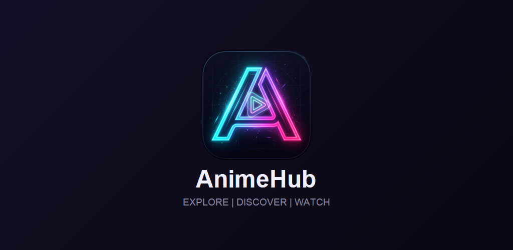

<div align="center">
  
  
  <br/>
  
  
  
  
  
  
  
  
  <br/><br/>

  <p><strong>AnimeHub</strong> — A production-ready, full-featured anime streaming and community app built with React Native & Expo SDK 52.<br/>
  Stream episodes, download HLS video offline, sync watch progress across devices, manage premium subscriptions, and engage with community requests & reviews.</p>
</div>

---

## ✨ Features

### 🎬 Hybrid Playback Engine
- **In-App Streaming Player** — Embedded WebView player with deep network sniffing (`injectedJS.ts`), intercepting `.m3u8` manifests and `.mp4` video streams.
- **Built-in Ad & Pop-up Blocker** — Domain-level blocking and injected script suppression for third-party stream hosts.
- **Multi-Server Switching** — Seamlessly switch between streaming servers with automatic error detection and failover (`ServerPickerSheet`).
- **Netflix-Style Controls** — Double-tap to seek ±10s with animated edge ripple waves (`DoubleTapSeek`), auto-skip intros/outros, auto-play next episode with countdown, and full-screen landscape orientation lock.
- **Resume Playback** — Automatically picks up from the exact second you left off, with progress synced to Supabase every 10 seconds.

### 💾 Offline Downloads & Storage Manager
- **HLS Segment Downloader** — Sniffs `.m3u8` playlists, downloads `.ts` video chunks to local storage via `expo-file-system`, and rewrites playlists for offline playback (`useHlsDownloader.ts`).
- **Native Offline Player** — Plays downloaded episodes completely offline using Expo's modern native player (`expo-video`).
- **Storage Management** — View disk usage per anime/episode and delete cached downloads in [`downloads.tsx`](./app/downloads.tsx).

### 🌐 Dual External API Sync & Discovery
- **AniList GraphQL & Jikan v4 Integration** — Fetches live trending, seasonal releases, and top-rated anime directly from AniList and MyAnimeList (via Jikan).
- **Catalog Cross-Referencing** — Automatically matches external `mal_id`s against your Supabase database so users only see titles they can actually stream, with graceful DB fallbacks.

### 🔒 Enterprise Authentication & Security
- **Supabase Auth** — Email and password authentication with instant session hydration.
- **Multi-Factor Authentication (MFA / 2FA)** — Time-based One-Time Password (TOTP) verification enforcing Authenticator Assurance Level 2 (AAL2).
- **OAuth Callback Deep-Linking** — Deep-link routing for third-party auth providers (`auth/callback.tsx`).
- **PostgreSQL Row-Level Security (RLS)** — Fine-grained user policies protecting watch progress, user profiles, notifications, and device tokens.

### 💎 Subscriptions & Monetization
- **Dynamic Plan Matrix** — Free vs. Premium Monthly vs. Premium Yearly tier comparison (`plans.tsx`), driven dynamically by Supabase database tables (`subscription_plans`, `plan_features`).
- **Subscription Management** — Active plan status, renewal dates, and payment card management (`manage-plan.tsx`, `premium.tsx`).

### 📊 Gamified Stats, Badges & Schedule
- **Release Schedule** — Weekly anime broadcast calendar categorized by day of the week (`schedule.tsx`).
- **User Watch Analytics** — Track total hours watched, episode milestones, and watch streaks.
- **Unlockable Badges** — Gamified badges (e.g. *First Ep*, *Hunter*, *Dedicated*, *Shonen*) with live progress bars (`stats.tsx`).

### 🔔 Push Notifications & Localization
- **Expo Push Notifications** — Token registration (`usePushNotifications.ts`), token persistence in `user_push_tokens`, and direct deep-linking on tap.
- **In-App Notification Feed** — Categorized notifications (Episodes, Social, System) with unread filtering (`notifications.tsx`).
- **Bilingual Localization (i18n)** — Seamless switching between English and Japanese (`LocalizationContext.tsx`, `translations.ts`).

### 🗳️ Community Requests & Reviews
- **Anime Request System** — Request unlisted anime with MyAnimeList ID detection, duplicate merging, and atomic upvoting RPC (`requestAPI`).
- **Community Reviews** — User reviews, star ratings, and spoiler protection flags (`anime/reviews/[id].tsx`).

---

## 📱 Screen & Route Directory

| Route / Screen | File Location | Description |
| :--- | :--- | :--- |
| **Home Feed** | [`app/(tabs)/index.tsx`](./app/(tabs)/index.tsx) | Hero carousel, trending rows, top-rated, seasonal arrivals, and quick-filter pills. |
| **Explore & Search** | [`app/(tabs)/explore.tsx`](./app/(tabs)/explore.tsx) | Live multi-query search (English, Romaji, Japanese) and genre cards. |
| **Library** | [`app/(tabs)/library.tsx`](./app/(tabs)/library.tsx) | User watchlist, custom status filters, and quick resume. |
| **Profile** | [`app/(tabs)/profile.tsx`](./app/(tabs)/profile.tsx) | Avatar upload, streak counter, total watch time, badges, and account shortcuts. |
| **Watch Player** | [`app/watch/[id].tsx`](./app/watch/[id].tsx) | Full-screen landscape WebView player, double-tap seek, server selector, and HUD. |
| **Offline Downloads** | [`app/downloads.tsx`](./app/downloads.tsx) | Download manager and offline video playback powered by `expo-video`. |
| **Anime Detail** | [`app/anime/[id].tsx`](./app/anime/[id].tsx) | Synopsis, YouTube trailer modal, character list, relations, and episode browser. |
| **Episodes List** | [`app/anime/episodes/[id].tsx`](./app/anime/episodes/[id].tsx) | Complete searchable episode directory with pagination and download actions. |
| **Anime Reviews** | [`app/anime/reviews/[id].tsx`](./app/anime/reviews/[id].tsx) | Full community reviews list with spoiler reveal controls and review creation. |
| **Subscription Plans** | [`app/plans.tsx`](./app/plans.tsx) | Feature matrix comparison for Free, Monthly, and Yearly premium tiers. |
| **Manage Plan** | [`app/manage-plan.tsx`](./app/manage-plan.tsx) | Active subscription details, payment method management, and plan renewal. |
| **Premium Hub** | [`app/premium.tsx`](./app/premium.tsx) | Showcase of premium perks: 4K streaming, offline downloads, ad-free viewing. |
| **Release Schedule** | [`app/schedule.tsx`](./app/schedule.tsx) | Day-by-day weekly broadcast schedule powered by Jikan / MyAnimeList. |
| **Stats & Badges** | [`app/stats.tsx`](./app/stats.tsx) | Gamified watch analytics, genre distribution charts, and achievement badges. |
| **Watchlist** | [`app/watchlist.tsx`](./app/watchlist.tsx) | Dedicated personal watchlist with quick removal and watch status toggles. |
| **Favorites** | [`app/favorites.tsx`](./app/favorites.tsx) | Saved favourite anime series with fast navigation. |
| **Watch History** | [`app/history.tsx`](./app/history.tsx) | Chronological episode watch history with resume points. |
| **Notifications** | [`app/notifications.tsx`](./app/notifications.tsx) | Notification feed with category filters (All, Unread, Episodes, Social, System). |
| **Settings** | [`app/settings.tsx`](./app/settings.tsx) | Password updates, 2FA setup, player preferences, localization, and cache clearing. |
| **Genre Explorer** | [`app/genre/[name].tsx`](./app/genre/[name].tsx) | Anime catalog filtered by specific genre with curated artwork. |
| **Studio Showcase** | [`app/studio/[name].tsx`](./app/studio/[name].tsx) | Titles filtered by production studio (MAPPA, Ufotable, Bones, etc.). |
| **Auth: Login** | [`app/auth/login.tsx`](./app/auth/login.tsx) | Modal login with email/password and Supabase authentication. |
| **Auth: Signup** | [`app/auth/signup.tsx`](./app/auth/signup.tsx) | Account registration with real-time unique username availability check. |
| **Auth: 2FA / MFA** | [`app/auth/mfa.tsx`](./app/auth/mfa.tsx) | TOTP two-factor authentication verification screen. |
| **Auth: Callback** | [`app/auth/callback.tsx`](./app/auth/callback.tsx) | Deep-link OAuth redirect and session exchange handler. |

---

## 🏗️ Tech Stack

| Layer | Technology |
| :--- | :--- |
| **Framework** | [Expo SDK 52](https://expo.dev) + [Expo Router v4](https://docs.expo.dev/router/introduction/) (File-based navigation) |
| **Runtime** | React Native 0.76.9 with **New Architecture enabled** |
| **Language** | TypeScript ~5.3.3 (Strict mode) |
| **Styling** | [NativeWind v4](https://www.nativewind.dev/) (Tailwind CSS 3.4), Expo Linear Gradient, Expo Blur |
| **State & Cache** | [TanStack React Query v5](https://tanstack.com/query) + [Zustand](https://zustand-demo.pmnd.rs/) |
| **Backend & Auth** | [Supabase](https://supabase.com) (PostgreSQL, Auth, RLS, Storage, RPC Functions) |
| **Video Playback** | `react-native-webview` (Streaming + Injected JS) + `expo-video` (Offline Native Player) |
| **Media Downloader** | Custom HLS chunk parser & segment downloader built on `expo-file-system` |
| **Image Caching** | `expo-image` (High-performance disk & memory caching) |
| **Notifications** | `expo-notifications` + `expo-device` |
| **External APIs** | AniList GraphQL API + Jikan v4 (MyAnimeList proxy) |

---

## 🚀 Getting Started

### Prerequisites
- **Node.js** ≥ 18.x
- **Yarn** (recommended) or npm
- **Expo CLI** (`npm install -g expo-cli` or use via `npx expo`)
- **Android Studio** (for Android Emulator) or **Xcode** (for iOS Simulator, macOS only)
- A **Supabase** account and project

### Installation

```bash
# 1. Clone the repository
git clone https://github.com/gamerboy74/Animehub-App.git
cd Animehub-App

# 2. Install dependencies
yarn install

# 3. Apply postinstall patches
yarn postinstall
```

### Environment Configuration

Create a `.env` file in the root directory:

```env
EXPO_PUBLIC_SUPABASE_URL=https://your-project-ref.supabase.co
EXPO_PUBLIC_SUPABASE_ANON_KEY=your-supabase-anon-key
```

> 🔒 **Security Notice:** Never commit `.env` to version control. It is protected by `.gitignore`.

---

## 🗄️ Supabase Database Setup & Migrations

AnimeHub Mobile relies on several tables, security policies, triggers, and RPC helper functions. Apply the SQL migrations located in [`supabase/migrations/`](./supabase/migrations) in your **Supabase SQL Editor** or via the Supabase CLI:

```bash
# Optional: Link and push migrations via Supabase CLI
npx supabase link --project-ref your-project-ref
npx supabase db push
```

### Migrations Overview

| Migration File | Description |
| :--- | :--- |
| [`20240524_subscription_plans.sql`](./supabase/migrations/20240524_subscription_plans.sql) | Creates `subscription_plans` and `plan_features` tables with seed data and public RLS read policies. |
| [`20240524_episode_servers.sql`](./supabase/migrations/20240524_episode_servers.sql) | Adds `video_servers` JSONB column to `episodes` with fallback backfills. |
| [`20260524_user_preferences_auto_skip_intro.sql`](./supabase/migrations/20260524_user_preferences_auto_skip_intro.sql) | Adds `auto_skip_intro` preference toggles to `user_preferences`. |
| [`20260527_anime_requests.sql`](./supabase/migrations/20260527_anime_requests.sql) | Creates `anime_requests` table with duplicate title detection and RLS policies. |
| [`20260527_upvote_enforcement.sql`](./supabase/migrations/20260527_upvote_enforcement.sql) | Creates `upvote_anime_request(request_id)` atomic Postgres RPC procedure. |
| [`20260530_add_anime_episode_notifications.sql`](./supabase/migrations/20260530_add_anime_episode_notifications.sql) | Sets up triggers and notification logging for newly added episodes. |
| [`20260530_add_localization_preferences.sql`](./supabase/migrations/20260530_add_localization_preferences.sql) | Adds `preferred_language` preference support to `user_preferences`. |
| [`20260601_add_use_native_player_preference.sql`](./supabase/migrations/20260601_add_use_native_player_preference.sql) | Adds player engine preference flags (`use_native_player`). |
| [`20260601_create_user_push_tokens.sql`](./supabase/migrations/20260601_create_user_push_tokens.sql) | Creates `user_push_tokens` table with multi-device support and RLS management. |

### Supabase Storage Buckets
Ensure the following storage buckets are created in your Supabase project with public read access:
- **`user-avatars`** — Stores user profile avatars.
- **`anime-posters`** — Storage fallback for posters and artwork.

---

## 🏃 Running the Application

```bash
# Start Metro bundler with cache reset
npx expo start --clear

# Run directly on Android
yarn android

# Run directly on iOS
yarn ios

# Run TypeScript type check
yarn typecheck
```

---

## 📁 Project Structure

```
Animehub-App/
├── app/                        # Expo Router navigation (file-based routes)
│   ├── (tabs)/                 # Bottom tab bar routes
│   │   ├── index.tsx           # Home feed & hero carousel
│   │   ├── explore.tsx         # Search & genre browsing
│   │   ├── library.tsx         # User watchlist & status filters
│   │   └── profile.tsx         # Profile stats, streak & badges
│   ├── anime/                  # Anime screens
│   │   ├── [id].tsx            # Detail screen & trailer modal
│   │   ├── episodes/[id].tsx   # Complete episode directory
│   │   └── reviews/[id].tsx    # Community reviews & ratings
│   ├── auth/                   # Authentication flow
│   │   ├── login.tsx           # Modal email login
│   │   ├── signup.tsx          # Registration with username checker
│   │   ├── mfa.tsx             # TOTP 2FA verification modal
│   │   └── callback.tsx        # Deep-link OAuth callback
│   ├── genre/[name].tsx        # Filtered anime by genre
│   ├── studio/[name].tsx       # Filtered anime by studio
│   ├── watch/[id].tsx          # Full-screen stream player & HUD
│   ├── downloads.tsx           # Offline downloads & expo-video player
│   ├── plans.tsx               # Subscription tiers comparison matrix
│   ├── manage-plan.tsx         # Active plan management & billing
│   ├── premium.tsx             # Premium perks promotional hub
│   ├── schedule.tsx            # Weekly broadcast schedule
│   ├── stats.tsx               # Gamified watch stats & badges
│   ├── watchlist.tsx           # Dedicated watchlist screen
│   ├── favorites.tsx           # Saved favourites screen
│   ├── history.tsx             # Watch history
│   ├── notifications.tsx       # Notification feed & filters
│   ├── settings.tsx            # User settings & preferences
│   └── _layout.tsx             # Root layout, AuthGuard & fonts
├── src/
│   ├── components/             # Reusable UI & player components
│   │   ├── layout/             # Glass layout & wrappers
│   │   ├── player/             # DoubleTapSeek, HUD, EpisodeSelector, NextUpCard
│   │   ├── settings/           # Avatar modal, 2FA modal, card modal, anime request modal
│   │   └── ui/                 # AnimeCard, HeroBanner, UniversalHeader, etc.
│   ├── constants/              # Theme tokens, colors, translations (en/ja)
│   ├── context/                # AuthContext, LocalizationContext
│   ├── hooks/                  # TanStack Query hooks, useHlsDownloader, usePushNotifications, etc.
│   ├── lib/                    # Supabase client, injectedJS, htmlPlayer, jikan, anilist
│   ├── screens/                # Shared stylesheet definitions (*.styles.ts)
│   ├── store/                  # Zustand stores (playerStore, animeStore)
│   └── types/                  # Database and domain TypeScript definitions
├── supabase/
│   └── migrations/             # SQL migrations for Supabase backend
├── assets/                     # Icons, splash screen, banner, and typography
├── patches/                    # patch-package fixes for dependencies
├── app.json                    # Expo project configuration (version 1.0.2)
├── eas.json                    # EAS Build & release profiles
├── babel.config.js             # Babel & NativeWind configuration
├── tailwind.config.js          # Tailwind theme & color tokens
└── package.json                # Project dependencies & scripts
```

---

## 📦 Building for Production

This project is configured with [EAS Build](https://docs.expo.dev/build/introduction/):

```bash
# 1. Install EAS CLI globally
npm install -g eas-cli

# 2. Authenticate with Expo
eas login

# 3. Configure credentials
eas credentials

# 4. Build APK or AAB for Android
eas build --platform android --profile production

# 5. Build for iOS
eas build --platform ios --profile production
```

---

## 🤝 Contributing

1. Fork the repository
2. Create your feature branch: `git checkout -b feature/amazing-feature`
3. Verify TypeScript compiles without errors: `yarn typecheck`
4. Commit your changes: `git commit -m 'feat: add amazing feature'`
5. Push to the branch: `git push origin feature/amazing-feature`
6. Open a Pull Request

---

## 📄 License

This project is private and proprietary. All rights reserved © 2026 gamerboy74.
